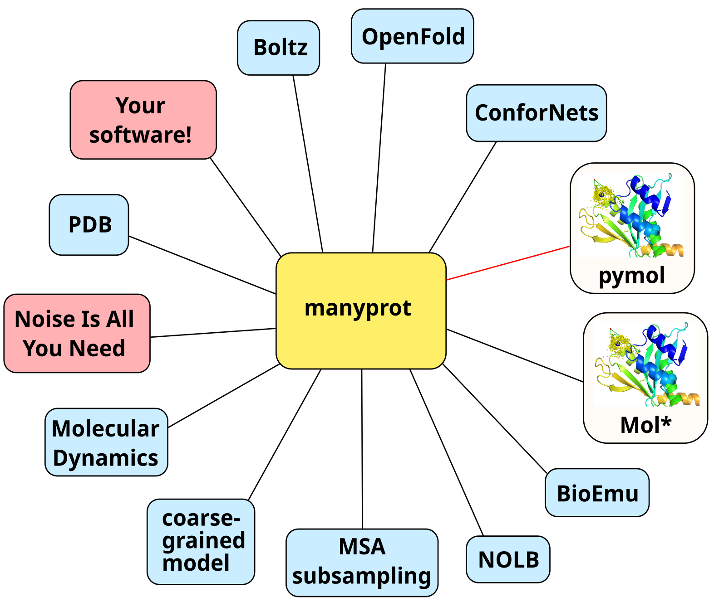

# manyprot - Mapping protein conformation landscapes

You can have a look at our posters:
* ML4NGP 2025 in Warsaw, [Mapping Conformation Landscapes
hidden in ESMFold protein language models](https://drive.google.com/file/d/1AMM9-OdYmMUuoG0vgW1UG6zvoC4hENeW/view?usp=sharing)
* ML4NGP 2025 in Vilnius, [Noise Is All You Need](https://drive.google.com/file/d/1sKGB4QNUezTiU4pzB9scsGe4nFd8z0hW/view?usp=sharing)
  
If you have an idea for protein structure diversity source to be integrated with Manyprot, share it in [Discussions](https://github.com/vaclavhanzl/manyprot/discussions/1).

This project is in a design phase, though we have some code nearly ready. At the moment you may already enjoy Jupyter-pymol connection - just put jupymol.py to your project (proper mamba package to follow soon) and do:
```
%load_ext jupymol
from jupymol import pymol, pymol_3d_scatter, pymol_3d_line
```
and then you can use pymol(), %pymol and %%pymol in your Jupyter notebook. To see documentation, just run a cell like:
```
help pymol_3d_scatter
```

The idea of this project is to connect many sources of protein ctructure diversity into an easy to use whole:


## Modules
Possible examples are the boxes in the picture above, of several types:
* protein diversity sources, generating structures (maybe on request, with specific properties, e.g. with certain values of some latent variables, interpolating structures etc.)
* visualization modules, showing some proteins and accompanying graphics (like point cloud for one atom in many more structures)
* central module, being e.g. Jupyter notebook or web application, allowing user to control the rest

## Representations
Different ways to store the structure:
* .pdb file
* XYZ atom coordinates in pytorch tensor

## Operations
Ways to get different conformers of a protein:
* download from PDB
* predict multiple structures (e.g. via diffusion in AF3-alikes)
* drive structures to underexplored regions, e.g. by varions disruptions (noise in our ESM-based system, special layers in ConforNets, MSA subsampling) or by MD or coarse-grained simulations.

Module can be capable of multiple operations.

# How to connect new module
The idea is to keep things really simple, like running a script in some mamba/conda environment which would take fasta file and generate many pdb files.

But we can also do things like running a job on remote PBS-controlled meta-cluster or using web-like remote procedure calls.

